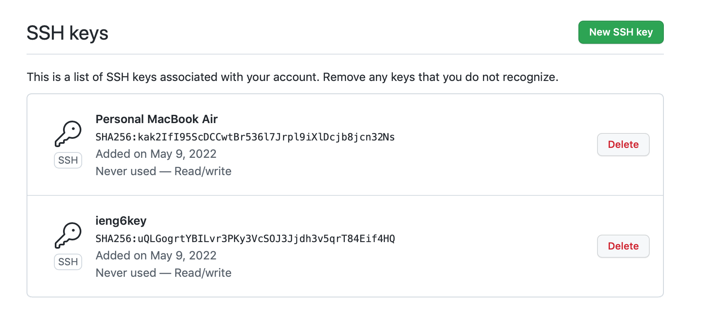
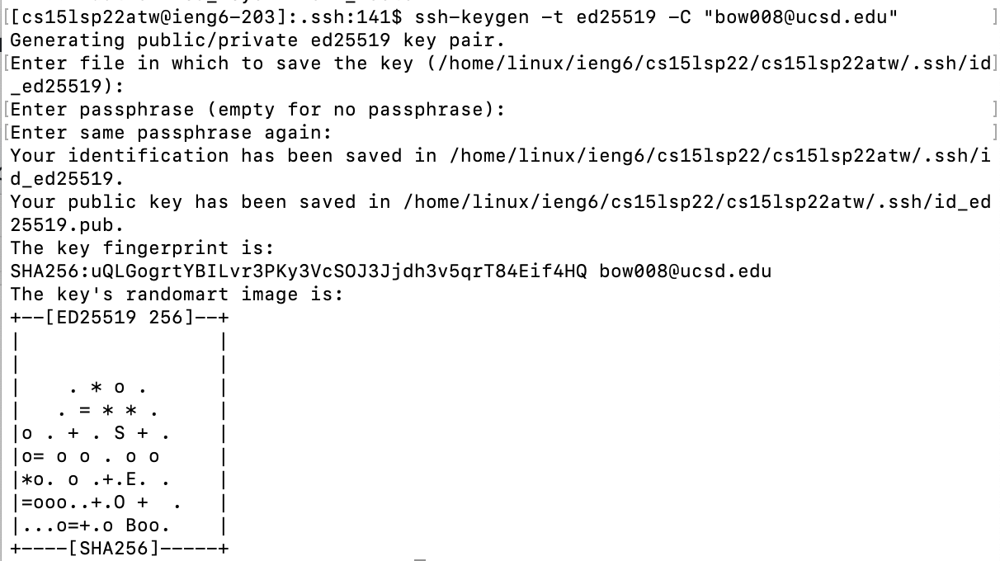
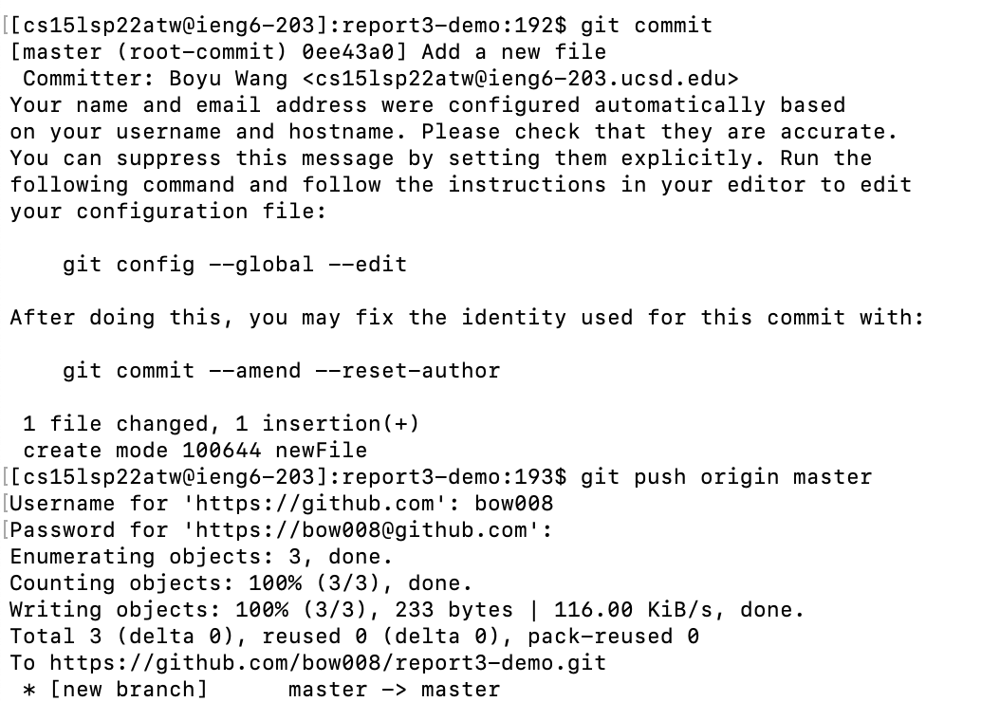

# Week 6 Lab Report

## Streamlining ssh Configuration

We can open the `.ssh` directory, which the Finder normally hides, by using the `open` command:

As you can see, the `config` file is here.

Here is what the `config` file looks like (with VSCode):

Here is an `scp` command copying the file `run.sh` to my account using the alias `ieng6`:

## Setup Github Access from ieng6

The public key is stored on Github:

The public and private keys in my user account:

Running git commands to commit and push a change to
Github while logged into your ieng6 account:

Here is [the resulting commit](https://github.com/bow008/report3-demo/commit/0ee43a0b9f3c955d6e848524a4c5aa59b851f090)

## Copy whole directories with scp