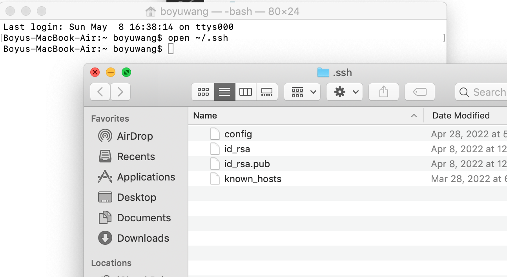
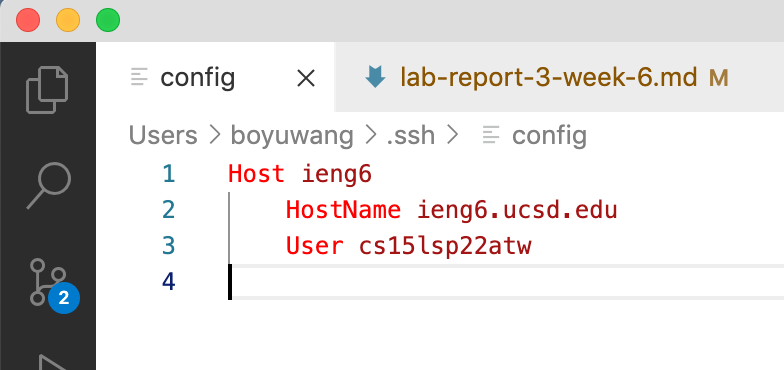
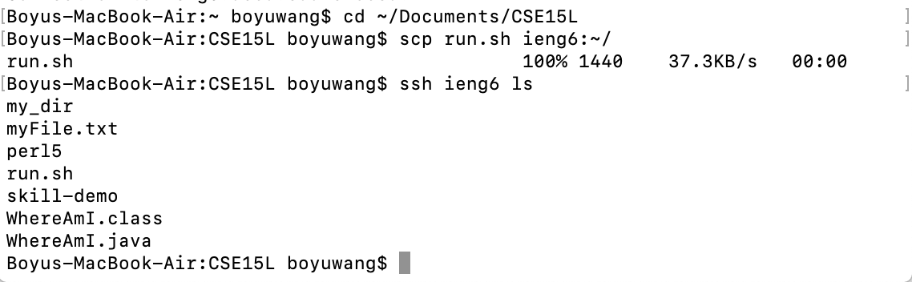

# Week 6 Lab Report

## Streamlining ssh Configuration

We can open the `.ssh` directory, which the Finder normally hides, by using the `open` command:

As you can see, the `config` file is here.

Here is what the `config` file looks like (with VSCode):

Here is an `scp` command copying the file `run.sh` to my account using the alias `ieng6`:

## Setup Github Access from ieng6

## Copy whole directories with scp