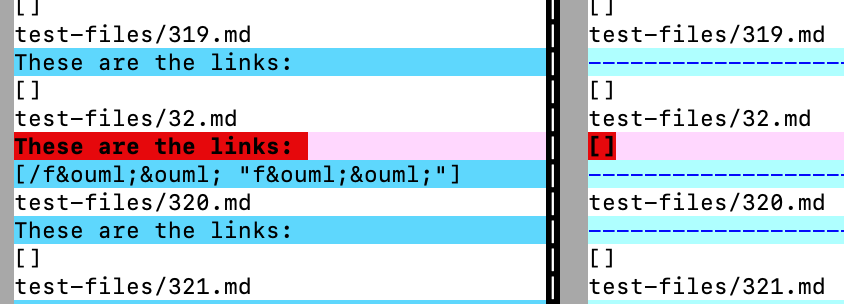
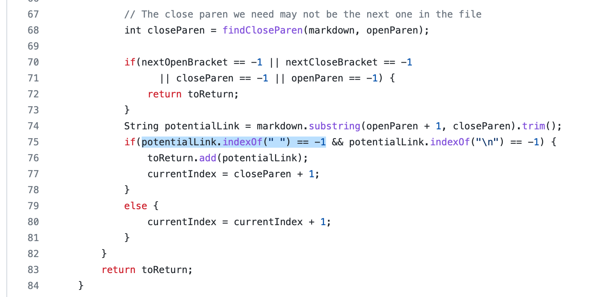
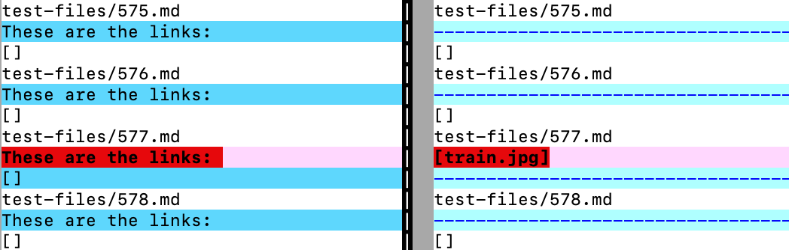
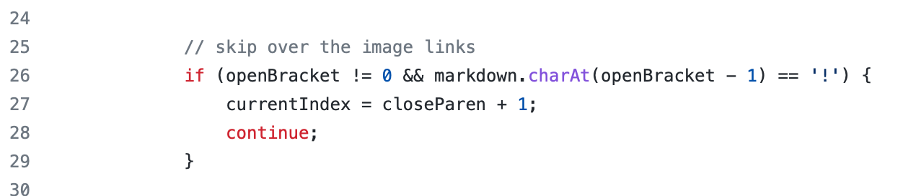

# Week 10 Lab Report

I used `vimdiff` on the results of running a bash for loop to find the tests with different results.

$~$

One test where my implementation had different answers than the implementation provided for lab 9 is [test 32](https://github.com/nidhidhamnani/markdown-parser/blob/main/test-files/32.md?plain=1). 

Here are the actual outputs (the output of my implementation is on the left; the output of the provided implementation is on the right):

By using [the CommonMark demo site](https://spec.commonmark.org/dingus/), I think it *should* produce [/f\&ouml;\&ouml; "f\&ouml;&\ouml;"]. Therefore, I think my implementation is correct.

I think the reason why the provided implementation did not produce any link for this test is that there is a space in the link of this test. Here is a screenshot of the part of MarkdownParse.java in the provided implementation that is causing the problem:

As you can see, when there is space in the `potentialLink`, the `potentialLink` is not treated as a valid link. That's where the problem is.

$~$

Another test where my implementation had different answers than the implementation provided for lab 9 is [test 577](https://github.com/nidhidhamnani/markdown-parser/blob/main/test-files/577.md?plain=1). 

Here are the actual outputs (the output of my implementation is on the left; the output of the provided implementation is on the right):

By using [the CommonMark demo site](https://spec.commonmark.org/dingus/), I think it *should* produce nothing, because the provided linked is an image, not a URL. Therefore, I think my implementation is correct.

I think the problem with the provided implementation is that it does not contain any code responsible for skipping over the image links. Therefore, a way to fix this is to add some code to detect image links (and skip them), like this:

