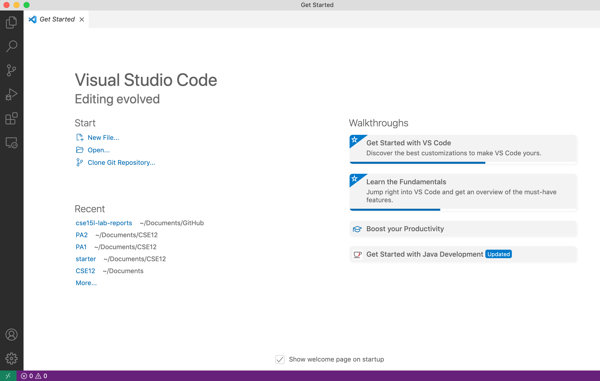
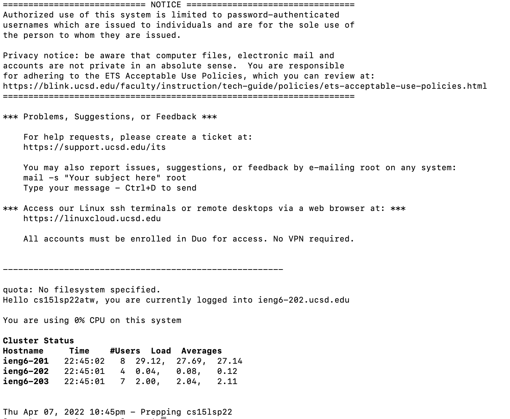
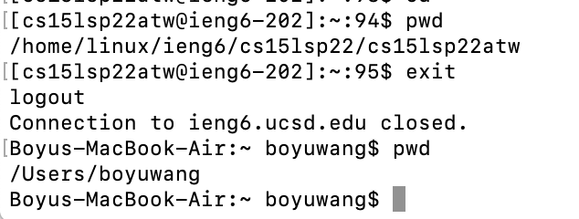
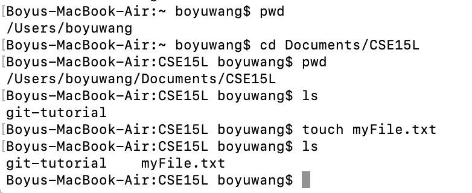
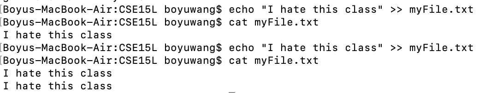
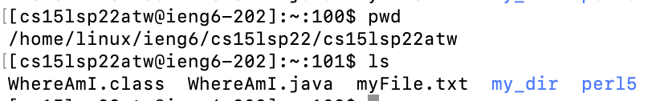
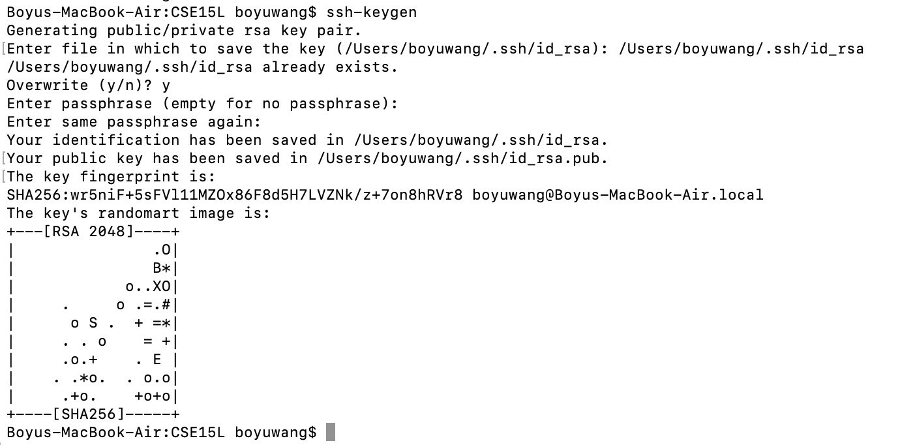

# Week 2 Lab Report
This is a tutorial about how to log into a course-specific account on `ieng6`. There are 6 steps.
<!--- ieng6 --->

***
## Step 1: Installing VScode
If you haven't installed Visual Studio Code yet, the first step is to go to the [Visual Studio Website](https://code.visualstudio.com/) and follow the instructions to download and install it on your computer.

When it is installed, you should be able to open a window that looks like this (it might have different colors, or a different menu bar, depending on your system and settings):

---
## Step2: Remotely Connecting
> If you are on Mac, ignore this. If you are on Windows, you need to first install a program called [OpenSSH](https://docs.microsoft.com/en-us/windows-server/administration/openssh/openssh_install_firstuse).

**substep 1**: Look up your course-specific account for CSE15L [*here*](https://sdacs.ucsd.edu/~icc/index.php).

**substep 2**: Open your terminal. You can open your terminal in VS Code (Ctrl + `).

**substep 3**: Enter the following commend in terminal, <mark>but with the `zz` replaced by the letters in your course-specific account:</mark>

`$ ssh cs15lsp22zz@ieng6.ucsd.edu`

If this is your first time connecting to the server, you'll get a message like this:

` ⤇ ssh cs15lsp22zz@ieng6.ucsd.edu`

`The authenticity of host 'ieng6.ucsd.edu (128.54.70.227)' can't be established.`

`RSA key fingerprint is SHA256:ksruYwhnYH+sySHnHAtLUHngrPEyZTDl/1x99wUQcec.`

`Are you sure you want to continue connecting
(yes/no/[fingerprint])?`

You should type `yes` and press "Enter".

**substep 4**: Now, you will be prompted to enter your password. Don't freak out if your password don't show up on the screen when you type it; just type your password and press "Enter".

> After doing all of the above 4 substeps, your terminal will probably be connected to a computer in the CSE basement, and you'll receive a message like this:

And that's it!

***
## Step 3: Trying Some Commands
Now you can practice what you've learned in lectures! Try some commands, both on the remote computer and on your own computer. 

> To go back to your own computer, you can log out by typing `exit` and then press "Enter":

Here are some specific useful commands to try:

* `cd ~`
* `cd`
* `ls -lat`
* `ls -a`
* `ls <directory>` where `<directory>` is
`/home/linux/ieng6/cs15lsp22/cs15lsp22abc`, where the `abc` is one of the other group members’ username
* `cp /home/linux/ieng6/cs15lsp22/public/hello.txt ~/`
* `cat /home/linux/ieng6/cs15lsp22/public/hello.txt`

For example, now I am in the working directory `/Users/boyuwang/Documents/CSE15L`, and I use touch to create a txt file named "myFile.txt":

Now, we can use `echo` to write text in my file, and use `cat` to print out the text in my file:

Try more commands by yourself!

---

## Step 4: Moving Files with `scp`
Now if we want to copy a file from your computer to a remote computer, we can run the command `scp` from the *client* (that means from your computer, not logged into `ieng6`).

For example, if we want to move the file "myFile.txt" to the remote computer, we first need to make sure that the terminal is in the directiory where the file "myFile.txt" is located. this can be done using the command `cd`. In this case, we need to run the command `cd "/Users/boyuwang/Documents/CSE15L/"`.

Now, run this command: (as usually, using your username):

`scp myFile.txt cs15lsp22zz@ieng6.ucsd.edu:~/`

You should be prompted for a password just like when you log in with `ssh`. When you  log into ieng6 with ssh again, you can use `ls` to see that our file "myFile.txt" is in your home directory:

***

## Step5: Setting an SSH Key

If we don't want to retype the password every time we log into the remote server, there is a great solution: we can use `ssh` keys.

Here is what you should do:
1. Make sure you are on client (your own computer)
2. Type `ssh-keygen` on your terminal, and press "Enter".
3. When you are prompted to "enter file in which to save the key", you should enter `/Users/<user-name>/.ssh/id_rsa` (where `,user-name` is your own username), and press "Enter".
4. When you are prompted to enter passphrase, you need to **make sure that you do not add a passphrase**. Just press "Enter".
5. Now you should get a message telling you that your identification has been saved somewhere.

> This is what it basically looks like:

6. Now we need to copy the public key to the directory of your user account on the server. First, <mark>connect to the remote server</mark>, and enter `mkdir .ssh`.
7. Then, log out of the remote server. On client terminal, type 
`scp /Users/<user-name>/.ssh/id_rsa.pub cs15lsp22zz@ieng6.ucsd.edu:~/.ssh/authorized_keys`. **make sure you replace `<user-name>` and `zz` by your own username and your own account, respectively.**
***

And that's it! Next time when you try to connect to the remote server, you don't need to enter the password anymore.

## Step6: Optimizing Remote Running

Finally, there are some useful commands to make using the remote server more easily.
* You can write a command in quotes at the end of an command to directly run it on the remote server, then exit.

> This is what it basically looks like:

* You can also use the up-arrow on your keyboard to recall the last command that was run.

***

## End

This is the end of this tutorial. Thanks for learning!