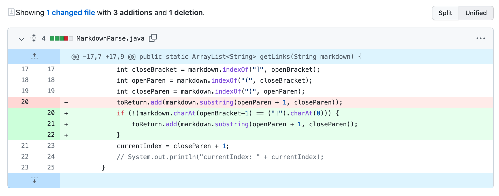
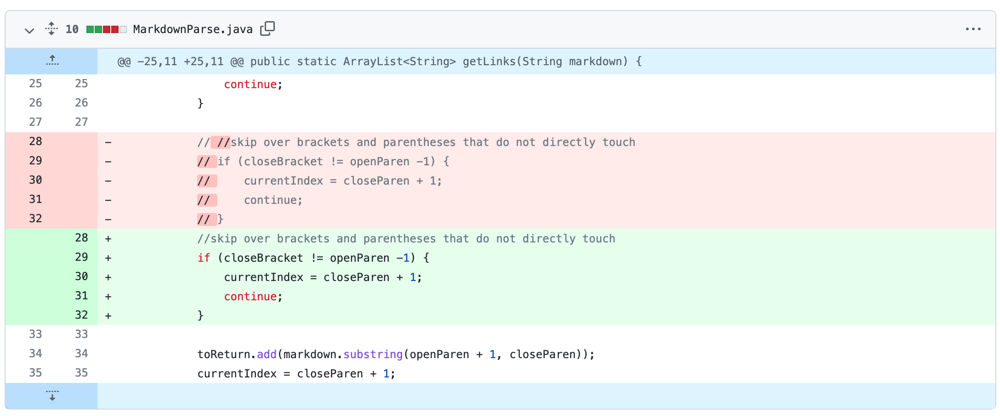

# Week 4 Lab Report

## Code change 1

Here is a screenshot of the code change diff:



> Here is the [test file](https://github.com/bow008/markdown-parser/blob/main/newTestFile.md?plain=1) for a *failure-inducing input* that prompted me to make that change.

Below is the output of running the file at the command line for the version where it was failing:

```
java MarkdownParse newTestFile.md
[https://something.com, some-thing.html, screenshot.png]
```

The bug is that there isn't code that handles image URLs in MarkdownParse.java. The failure-inducing input is a markdown file that includes a URL of an image. The symptom is that when I run the program I will get the image URLs along with the URLs of the links.


## Code change 2

Here is a screenshot of the code change diff:


> Here is the [test file](https://github.com/bow008/markdown-parser/blob/main/test-file2.md?plain=1) for a *failure-inducing input* that prompted me to make that change.

Below is the output of running the file at the command line for the version where it was failing:

```
Exception in thread "main" java.lang.StringIndexOutOfBoundsException: String index out of range: -2
	at java.base/java.lang.StringLatin1.charAt(StringLatin1.java:48)
	at java.base/java.lang.String.charAt(String.java:1512)
	at MarkdownParse.getLinks(MarkdownParse.java:20)
	at MarkdownParse.main(MarkdownParse.java:34)
```

The bug is that in MarkdownParse.java there is no mechanism for the while loop to stop when there are no more URLs but there are other texts in the markdown file. The symptom is that the program can compile but it cannot run.

## Code change 3

Here is a screenshot of the code change diff:



> Here is the [test file](https://github.com/bow008/markdown-parser/blob/main/new-breaker.md?plain=1) for a *failure-inducing input* that prompted me to make that change.

Below is the output of running the file at the command line for the version where it was failing:

```
java MarkdownParse new-breaker.md
[https://en.wikipedia.org/wiki/Danny_DeVito, ]
```

The bug is that MarkdownParse.java does not have a mechanism to skip over brackets and parentheses that do not directly touch. The symptom is that when we have a test file such as the file above, we would get an incorrect output. 