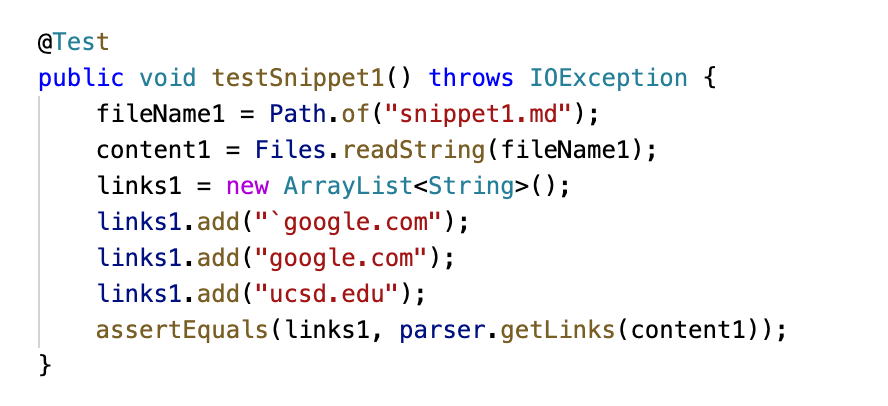
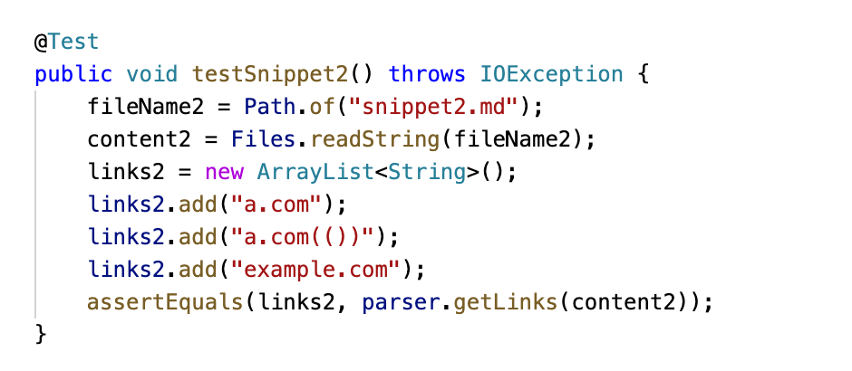
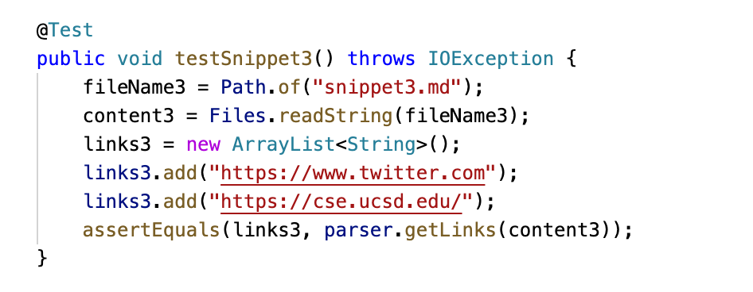
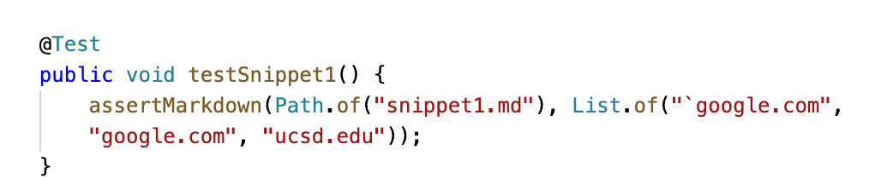
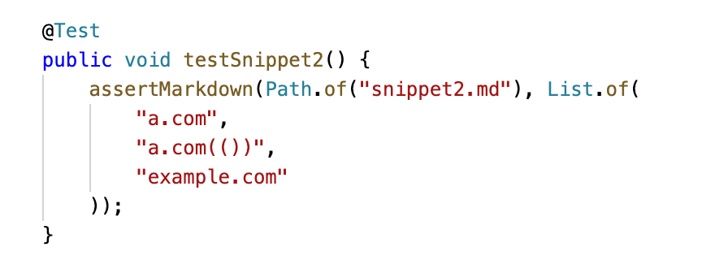
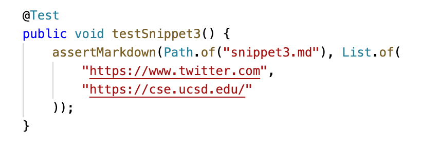

# Week 8 Lab Report

Here's the link to my markdown-parse repository:

Here's teh link to the one I reviewed in week 7:

Here's the code in `MarkdownParseTest.java` in my markdown-parse repositiory, for snippet1, snippet2, and snippet3, respectively:

Here's the code in `MarkdownParseTest.java` in the repositiory that I reviewed, for snippet1, snippet2, and snippet3, respectively:

