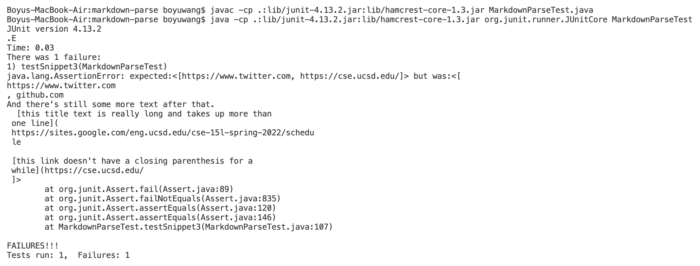
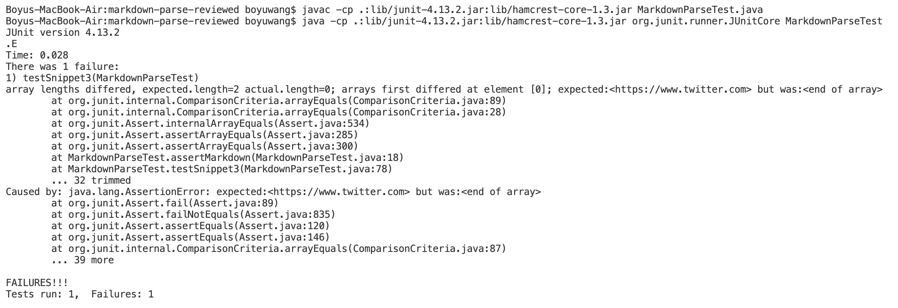

# Week 8 Lab Report

Here's the link to my markdown-parse repository: 
[link](https://github.com/bow008/markdown-parse)

Here's the link to the one I reviewed in week 7: [link](https://github.com/rmccrystal/markdown-parser)

I used [the CommonMark demo site](https://spec.commonmark.org/dingus/) as reference to decide what each test *shoud* produce.

## My implementation of `markdown-parse`:

Here's the code in `MarkdownParseTest.java` in my markdown-parse repositiory, for snippet1:

And my implementation of markdown-parse failed this test:

I think a possible simple remedy is to add some code that detexts backticks, so that if a backtick is detected, the program immediately tries to find the next backtick, and ignores everying between the two backticks. Note that tickmarks in the parenthesis that contains the link do not need to be detected.

Here's the code in `MarkdownParseTest.java` in my markdown-parse repositiory, for snippet2:

And my implementation of markdown-parse failed this test:

I think at least two things need to be fixed in my implementation of markdown-parse. First, there sholud be something to detect backslashes, so that brackets after backslashes would be escaped. Second, the parsing of parenthesis needs to be treated more carefully.

Here's the code in `MarkdownParseTest.java` in my markdown-parse repositiory, for snippet3:

And my implementation of markdown-parse failed this test:

This one is way beyond the reach of my intelligence. I don't have any idea about how to fix it.

## The `markdown-parse` I reviewed:

Here's the code in `MarkdownParseTest.java` in the repositiory that I reviewed, for snippet1:

And it failed this test: 

Here's the code in `MarkdownParseTest.java` in the repositiory that I reviewed, for snippet2:

And it failed this test:

Here's the code in `MarkdownParseTest.java` in the repositiory that I reviewed, for snippet3:

And it failed this test:

